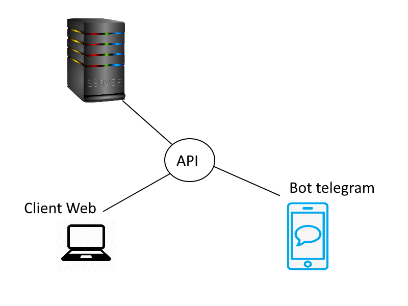

# 📰 ViktecNews 📰 #
-----------------------------------------------------

## Progetto Piattaforme Digitali per la Gestione del Territorio ##

### Appello: ###
* Primo appello sessione estiva 2018/2019

### Alunni: ###
* [Vittorio Russo](https://github.com/viktec)
* Matricola : 284038

-----------------------------------------------------

## Descrizione ##

Il progetto ViktecNews si pone come obiettivi primari:
* Raccogliere dati dall'url JSON del sito viktec.net
* Restituisce gli ultimi dieci articoli delle categorie scelte

-----------------------------------------------------

## Relazione ##

Il progetto è composto da 3 obiettivi principali:
 * Realizzazione di un API (GET e POST) in Node JS
 * Piattaforma Web online 
 * Implementazione di un BotTelegram Node JS
 
Altri obiettivi secondari:
 * Sfruttare più tecnologie possibili
 * Utilizzo della libreria axios

Lo scenario che abbiamo immaginato è il seguente, ma è importante notare che **questo progetto può essere ancora ampliato e arricchito con nuove funzionalità**.

-----------------------------------------------------

### Viktec API ###
* Realizzazione di un API (GET e POST) con Node JS e relativa [documentazione](https://app.swaggerhub.com/apis/viktec/Viktecnews/1.0.0#/):
   * Acquisizione di dati come news e recensioni da un sito in particolare, il quale mettono a disposizione OpenData tra cui:
     * [**Viktec** - Sito di recensioni e news di tecnologia](https://viktec.net/)

   * Gli step dell'algoritmo per l'acquisizione dei dati sul Json Viktec, sono i seguenti:
     1. Effettuta una richiesta HTTP per accedere ai dati desiderati
     2. Effettuta il parsing dei dati ricevuti attraverso l'opportuna funziona
     

   * Gli step dell'algoritmo della POST degli articoli sono i seguenti:
      1. Restituisce i dati selezionati dall'utente come messaggio
       
-----------------------------------------------------
### Messa online del servizio ###

Il file server.js, package.json e file .env( per chiave token bot) sono stati caricati su Glitch.com al seguente [indirizzo](https://glitch.com/edit/#!/viktecnews) 

-----------------------------------------------------

### ViktecNews_Bot ###

ViktecNews è il bot pensato per gli utenti che leggono news e recensioni direttamente dal bot invece di usare il Client Web.
Il bot permettere di scaricare le ultime dieci news, recensioni, guide e games da Telegram sfruttando le API di Viktec.
Questo bot è stato realizzato in Node JS e si interfaccia alla API di Telegram.

I comandi che il bot mette a disposizione sono i seguenti:

  *  /start : permette di iniziare una conversazione con il bot e come output la tastiera
  * utilizzo della keyboard : la tastiera viene ripetuta per ogni output, si può scegliere tra news, recensioni, guide, games e info. 
      * news : restituirà le ultime dieci news pubblicate sul client Web
      * recensioni : restituirà le ultime dieci recensioni pubblicate sul client Web
      * guide : restituirà le ultime dieci guide pubblicate sul client Web
      * games : restituirà gli ultimi dieci articoli di games pubblicate sul client Web
      * info : informazioni generali sul Bot e contatto dell'autore  
 

  
 

 

-----------------------------------------------------

### Links e riferimenti ###

 * Link Client web: https://viktec.net
 * Link API posts: https://www.viktec.net/wp-json/wp/v2/posts
 * Link API  posts categorie :
 - News : https://www.viktec.net/wp-json/wp/v2/posts?categories=8240
 - Recensioni : https://www.viktec.net/wp-json/wp/v2/posts?categories=8241
 - Guide : https://www.viktec.net/wp-json/wp/v2/posts?categories=8250
 - Games : https://www.viktec.net/wp-json/wp/v2/posts?categories=8245
 
 * Link ViktecNews_Bot: https://telegram.me/ViktecNews_Bot
 * Link alla documentazione del API: https://app.swaggerhub.com/apis/viktec/Viktecnews/1.0.0